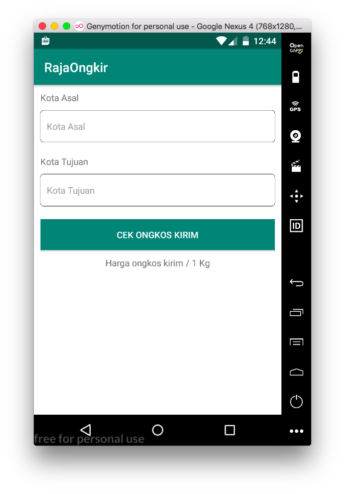
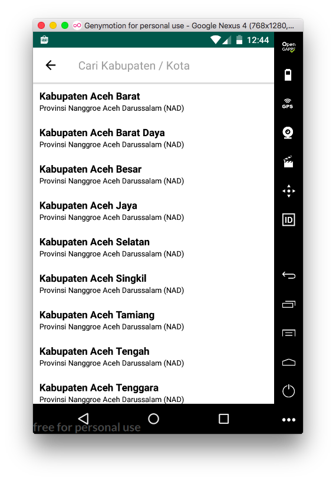
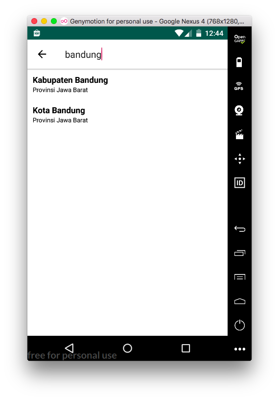
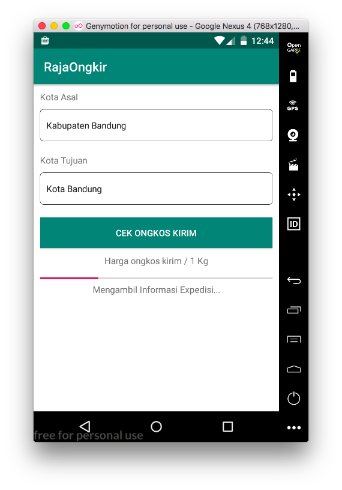
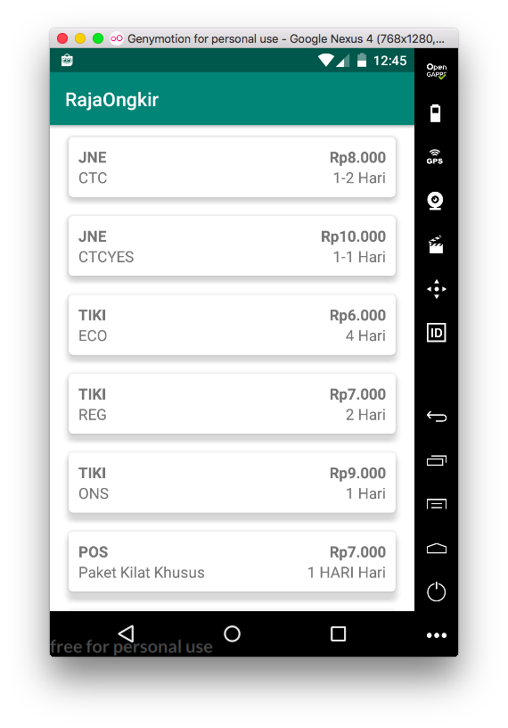

  <a href="#">
		<h1 align="center">RajaOngkir-App</h1>
  </a>

  RajaOngkir-App Merupakan Project OpenSource dengan menggunakan bahasa java dan menggunakan arsitektur MVP, serta menggunakan Api dari Raja Ongkir type Starter / Free, Project ini di buat bertujuan untuk pembelajaran.

 

 

 
Tampilan HomeScreen.

 

 

 
Tampilan Pencarian.

 

 

 
Tampilan Hasil Pencarian.

 

 

 
Tampilan Loading.

 

  

 
Tampilan Hasil.

 

